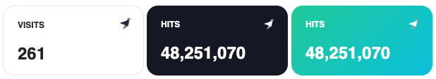

# Tinybird Widgets


# :warning: Use read-only Tinybird tokens, be very careful here with scope and permissions!

### Table of Contents  
- [Usage](#usage)  
- [Development](#development)

This service generates a widget from a single URL when passign a few attributes, so you can easily embed it on your website.


It follows this format:

```https://https://tinybird-widgets-flame.vercel.app?metric=visits&endpoint=https%3A%2F%2Fapi.tinybird.co%2Fv0%2Fpipes%2Fuc_visits_date.json%3Ftoken%3Dp.eyJ1...```

# Usage

```html
    <iframe
        frameborder="0"
        width=200
        height=100
        src="https://tinybird-widgets-flame.vercel.app?
            type=number
            &metric=visits
            &title=Visits
            &theme=dark
            &endpoint=https%3A%2F%2Fapi.tinybird.co%2Fv0%2Fpipes%2Fuc_visits_date.json%3Ftoken%3Dp.eyJ1...
        "
    ></iframe>
```

### Mandatory parameters:

| Parameter | Values |
| --------- | ------ |
| endpoint  | The Tinybird endpoint URL. Must be URL encoded, and the response in JSON format. You can use [this encoder](https://www.urlencoder.org/) manually or the `encodeURI()` function in JavaScript. |
| metric    | The row attribute you want to display as a metric. The widget will sum the values on all rows for that attribute. |

### Optional parameters:

| Parameter | Values | Default |
| --------- | ------ | ------- |
| logo      | Display Tinybird logo, `true` or `false` | `true` |
| type      | One of: `number` | `number` |
| title     | The title string you want for the card | |
| theme     | One of: `light`, `dark`, `green` | `light` |
| update-seconds | Integer for how many seconds between updates. 5 seconds is the minimun interval. | `light` |

> :warning: **Usage will increase** when using `update-seconds`, it'll make more requests and Tinybird cost will increase accordingly.

## Supported Widgets

### Number



```html
    <iframe
        frameborder="0"
        width=200
        height=100
        src="https://tinybird-widgets-flame.vercel.app?
            type=number
            &metric=visits
            &title=Visits
            &theme=dark
            &endpoint=https%3A%2F%2Fapi.tinybird.co%2Fv0%2Fpipes%2Fuc_visits_date.json%3Ftoken%3Dp.eyJ1...
        "
    ></iframe>
```

# Development
<a name="development"/>

```bash
npm i
npm start
```
